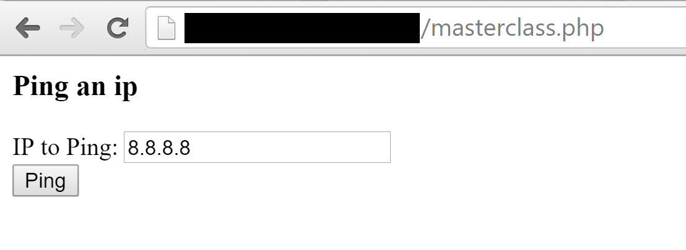
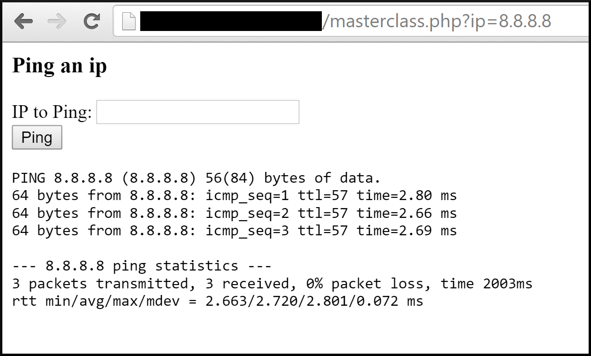
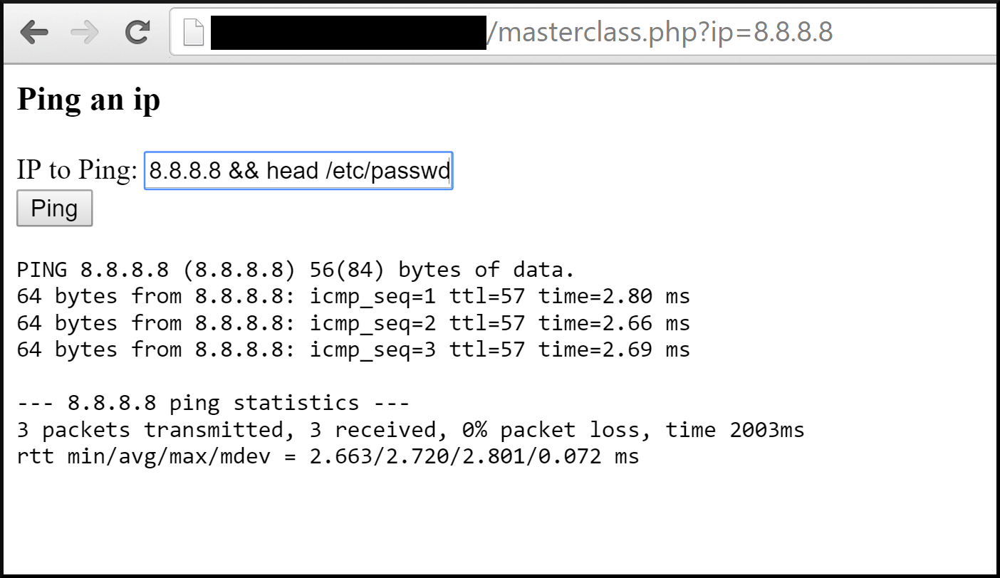
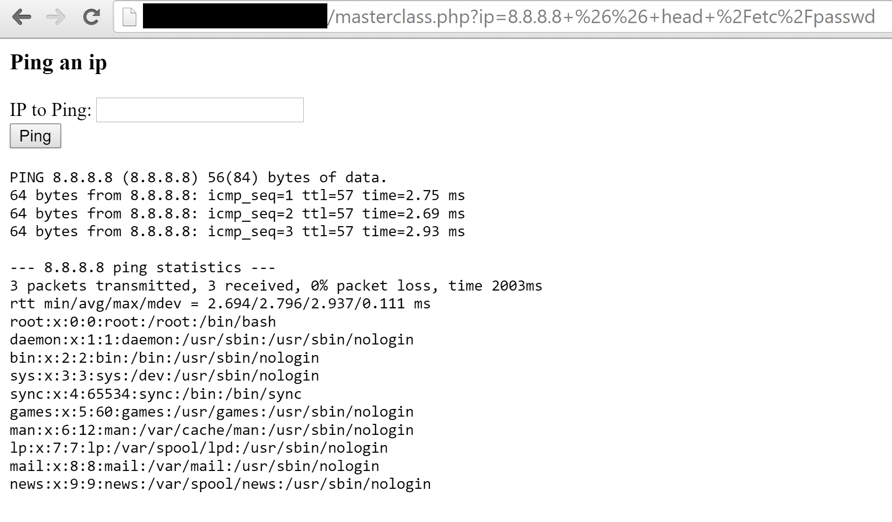

/*
Title: Command Injection
Description: Injection of commands through web application onto host machine.
*/

- LAST UPDATED DATE: 2015/12/1
- LAST UPDATED BY: @zaeyx

## Summary

Command Injection occurs when an insecure application passes unsafe user supplied content to a system shell.  

## Capabilities and Risk

When Command Injection occurs, and attacker may be able to execute arbitrary commands as the web application's host machine.  This gives effective control over whatever portion of the host machine the web server's user is given access to.  

## Detection

Detection can be accomplished by searching for command line access by the web server's user that is not expected to have been given by the normal operations of the application.  For example, if an application uses command line operations to perform a ping.  If the web server's user is executing any command other than "ping" you might have a problem.

One can search for abnormal commands in a number of ways, including but not limited to monitoring web user command line history, monitoring of logs (such as apache's access.log, monitoring of network traffic to detect requests on the wire (IDS for example), and hardcoding monitoring routines into the application itself.

## Remediation

Sanitize input that is passed to the system shell from an untrusted source.

Here are a number of resources to assist you in properly sanitizing data in a number of languages.

[PHP](https://stackoverflow.com/questions/982904/best-way-to-sanitize-exec-command-with-user-inserted-variables) 

[ASP.NET](https://msdn.microsoft.com/en-us/library/ff647397.aspx) 

[Ruby Rails](https://code.google.com/p/ruby-security/wiki/Guide#Good_ol%27_shell_injection)

[Java](https://www.securecoding.cert.org/confluence/display/java/IDS07-J.+Sanitize+untrusted+data+passed+to+the+Runtime.exec()+method)

[Python/Ruby](http://blog.littleimpact.de/index.php/2008/08/11/avoiding-shell-injection-in-ruby-python-and-php/)

Input sanitization is accomplished by removing/escaping special characters from user supplied input.  Or by properly quoting the user supplied input.


## References

https://www.owasp.org/index.php/Command_Injection

## Exploitation

To exploit this vulnerability, an attacker simply injects into a vulnerable field a command seperator for the system type (linux, windows) of the host machine in question.  Followed by the command to be executed.  

The command seperator is used to end the command that the application expects to execute, and everything that follows is added as commands appended to the application's usual request.

For example, if an application takes user input in the form of an IP address to "ping" from the command line; and the application does not correctly sanitize input:  A normal request might look like "ping user_supplied_ip".  The injection might look like "ping && cat /etc/passwd".

Example is illustrated below.

```php
<?php

if(isset($_GET['ip'])) {
        $ip = $_GET['ip'];
        $output = shell_exec("ping -c 3 $ip");
        echo "<pre>$output</pre>";
}
?>
```
The PHP code above is vulnerable to command injection since it does not sanitize any input.

**Here is what the ping form might look like with a user supplied IP to ping.**


**Once the user submits the form the site takes the IP parameter and drops it to the command line where it executes the command above.**


**However if the user was to supply a command seperator as seen here (Linux command seperator) they would be able to execute arbitrary commands, not just ping.**


**And the results...**


As you can see, exploitation is quite simple in a basic scenario like this.
