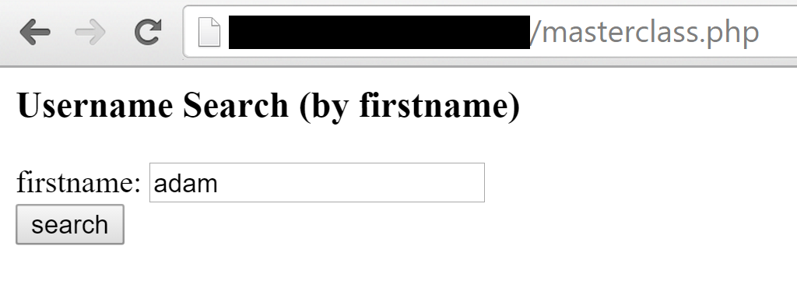
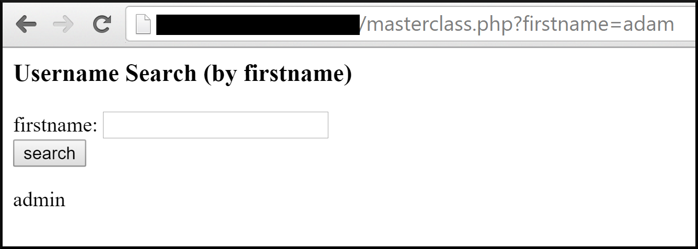
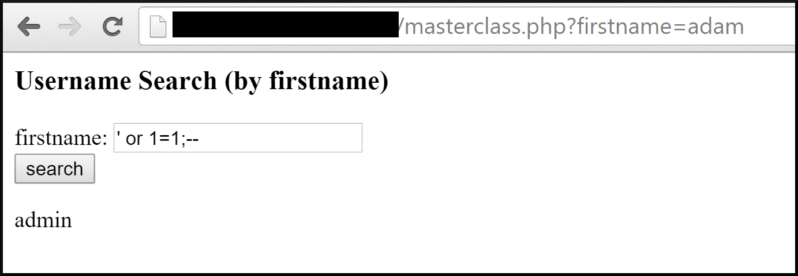
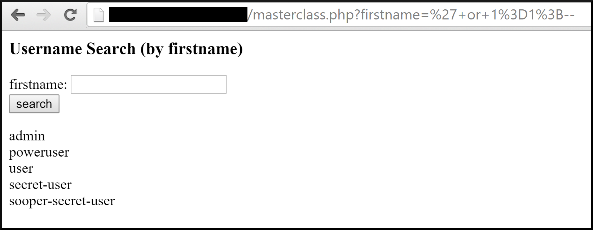

/*
Title: SQL Injection
Description: Injection of SQL commands directly into database
*/

- LAST UPDATED DATE: 2015/12/1
- LAST UPDATED BY: @zaeyx

## Summary

SQL Injection occurs when a unsanitized field takes content from an untrusted source and passes it directly into an SQL query.

## Capabilities and Risk

SQL Injection allows an attacker to execute arbitrary SQL in the context of the web application.  Potentially gaining the ability to read, write, and modify database contents.

## Detection

Detection can be accomplished by whitelisting known database lookups performed by the web application, and alerting if any commands other than the whitelisted ones are executed against the database in the context of the web application.

This can be accomplished by coding a method into whatever application is used to access the db, that performs these checks/alerts.  Mysql query history can also be [monitored directly.](https://stackoverflow.com/questions/21523811/mysql-commands-history)

Detection of SQLi can also be performed by network or host based IDS.

SQLi can also be detected by monitoring for unexpected changes to the database and its contents manually.  Or by monitoring the web application's logs (such as apache's access.log).  Or by monitoring network activity for signs of sensitive data being accessed by a remote party.


## Remediation

Correctly sanitize input into the database from any and all untrusted sources.

This resource provides instructions for proper sanitization in a number of languages: http://bobby-tables.com/
Another resource can be found [here](https://www.owasp.org/index.php/SQL_Injection_Prevention_Cheat_Sheet).

The main method by which one avoids SQLi is through the use of parametereized queries.  A parameterized query is a query for which specific inputs are mapped to specific parameters.  The exact way to implement is different in every language and for every library (SQL backend/server type).  However, here is a [wonderful resource, a multi-language cheat sheet from OWASP.](https://www.owasp.org/index.php/Query_Parameterization_Cheat_Sheet)

The end goal is to remove/escape special characters from the user supplied input.  Or to properly encapsulate the user supplied input in quotes that it cannot escape.  These methods can accomplish that for you.


## References

https://www.owasp.org/index.php/SQL_Injection

## Exploitation

An attacker can exploit this vulnerability by simply injecting arbitrary SQL into an unsanitized input field.  The attacker is usually required to properly guess the format of the query into which his input in injected.  He can then reverse engineer the format, causing his data to in effect "break out" of the query and create it's own.

For example.  If a query performs a lookup of username by first name in a users table it might look something like this: SELECT username FROM users WHERE firstname='user_supplied_firstname'.  In this scenario, the attacker would be able to "break out" of the quoted parameter by setting his input like so user_supplied_firstname = ' or 1=1;--

The final query would look like this: SELECT username FROM users WHERE firstname='' or 1=1;--

This would tell the SQL database to return all the usernames where the firstname is equal to '', or where 1=1.  1 is always equal to 1, therefore it always returns true.  This will cause the query therefore to return all of the usernames in the database.

It's a very basic example.  But it demonstrates exactly what SQLi is.  When special characters are allowed into a query unescaped, they can modify the query itself.

An example is demonstrated below.

```php
<?php
if(isset($_GET['firstname'])) {

        $search = $_GET['firstname'];
        $db = new SQLite3('users.db');
        $results = $db->query("SELECT username FROM users WHERE firstname='$search'");
        while($row = $results->fetchArray()){
                echo $row[0];
                echo "<br />";
        }
}
?>
```
The above PHP code is vulnerable to SQLi.  It doesn't attempt to escape or remove special characters from the user supplied input before passing it into the query.

It also does not use parameterized queries to wrap the user supplied input inside of quotes, forcing them to stay inside a specific parameter.

**A regular query would look like this.**


**Returning the expected result.**


**However, an attacker can modify the command.**


**And get every single username in the database dumped.**


As you can see, it doesn't take much for an attacker to exploit SQLi when presented with a vulnerable application.  
